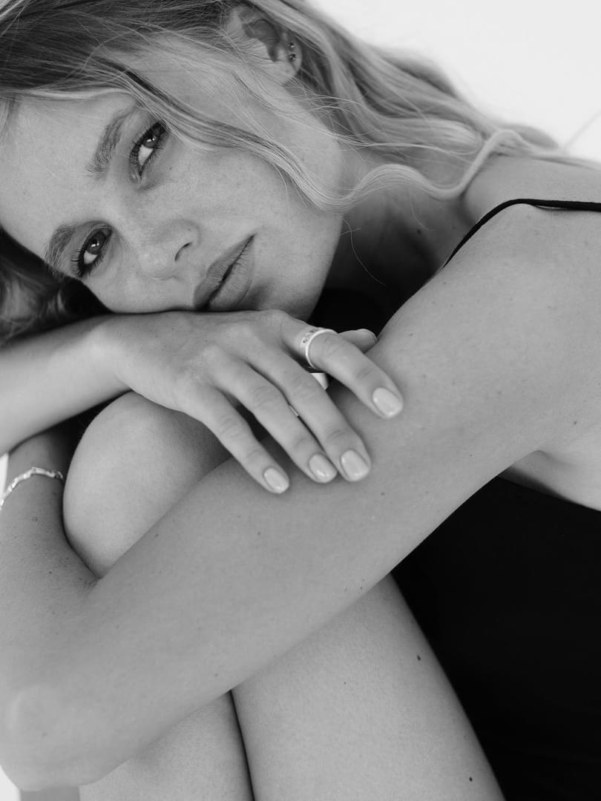

<!DOCTYPE html>
<html style="font-size: 16px;" lang="en"><head>
    <meta name="viewport" content="width=device-width, initial-scale=1.0">
    <meta charset="utf-8">
    <meta name="keywords" content="thankyou., 2022, ms-201, ​Jewelry House">
    <meta name="description" content="">
    <title>მთავარი</title>
    <link rel="stylesheet" href="nicepage.css" media="screen">
<link rel="stylesheet" href="მთავარი.css" media="screen">
    
    
    <meta name="generator" content="Nicepage 4.17.10, nicepage.com">
    <link id="u-theme-google-font" rel="stylesheet" href="https://fonts.googleapis.com/css?family=Roboto:100,100i,300,300i,400,400i,500,500i,700,700i,900,900i|Open+Sans:300,300i,400,400i,500,500i,600,600i,700,700i,800,800i">
    <link id="u-page-google-font" rel="stylesheet" href="https://fonts.googleapis.com/css?family=Raleway:100,100i,200,200i,300,300i,400,400i,500,500i,600,600i,700,700i,800,800i,900,900i">
    
    
    
    
    
    
    
    
    <meta name="theme-color" content="#2162e3">
    <meta property="og:title" content="მთავარი">
    <meta property="og:type" content="website">
  </head>
  <body data-home-page="მთავარი.html" data-home-page-title="მთავარი" class="u-body u-xl-mode" data-lang="en"><header class="u-align-center-sm u-align-center-xs u-clearfix u-header u-header" id="sec-63c8">

        
        <nav class="u-align-left u-menu u-menu-one-level u-offcanvas u-menu-1">
          

            <a class="u-button-style u-custom-border u-custom-border-color u-custom-borders u-custom-left-right-menu-spacing u-custom-text-active-color u-custom-text-color u-custom-text-hover-color u-custom-top-bottom-menu-spacing u-nav-link" href="#">
              <svg class="u-svg-link" preserveAspectRatio="xMidYMin slice" viewBox="0 0 302 302" style=""><use xmlns:xlink="http://www.w3.org/1999/xlink" xlink:href="#svg-8a8f"></use></svg>
              <svg xmlns="http://www.w3.org/2000/svg" xmlns:xlink="http://www.w3.org/1999/xlink" version="1.1" id="svg-8a8f" x="0px" y="0px" viewBox="0 0 302 302" style="enable-background:new 0 0 302 302;" xml:space="preserve" class="u-svg-content"><g><rect y="36" width="302" height="30"></rect><rect y="236" width="302" height="30"></rect><rect y="136" width="302" height="30"></rect>
</g><g></g><g></g><g></g><g></g><g></g><g></g><g></g><g></g><g></g><g></g><g></g><g></g><g></g><g></g><g></g></svg>
            </a>
          

          

            <ul class="u-nav u-spacing-20 u-unstyled u-nav-1"><li class="u-nav-item"><a class="u-button-style u-nav-link u-text-active-palette-1-base u-text-grey-90 u-text-hover-palette-2-base" href="მთავარი.html" style="padding: 10px;">მთავარი</a>
</li><li class="u-nav-item"><a class="u-button-style u-nav-link u-text-active-palette-1-base u-text-grey-90 u-text-hover-palette-2-base" href="ფასები-და-პირობები.html" style="padding: 10px;">ფასები და პირობები</a>
</li><li class="u-nav-item"><a class="u-button-style u-nav-link u-text-active-palette-1-base u-text-grey-90 u-text-hover-palette-2-base" href="პორტფოლიო.html" style="padding: 10px;">პორტფოლიო</a>
</li><li class="u-nav-item"><a class="u-button-style u-nav-link u-text-active-palette-1-base u-text-grey-90 u-text-hover-palette-2-base" href="კონტაქტი.html" style="padding: 10px;">კონტაქტი</a>
</li></ul>
          

          

            

              

                

                <ul class="u-align-center u-nav u-popupmenu-items u-unstyled u-nav-2"><li class="u-nav-item"><a class="u-button-style u-nav-link" href="მთავარი.html">მთავარი</a>
</li><li class="u-nav-item"><a class="u-button-style u-nav-link" href="ფასები-და-პირობები.html">ფასები და პირობები</a>
</li><li class="u-nav-item"><a class="u-button-style u-nav-link" href="პორტფოლიო.html">პორტფოლიო</a>
</li><li class="u-nav-item"><a class="u-button-style u-nav-link" href="კონტაქტი.html">კონტაქტი</a>
</li></ul>
              

            

            

          

        </nav>
      
</header>
    <section class="u-align-center u-clearfix u-image u-section-1" id="carousel_b0a0" data-image-width="1600" data-image-height="1067">
      

        

          

            <h1 class="u-custom-font u-text u-text-1">მოგესალმებით</h1>
          

        

      

    </section>
    <section class="u-clearfix u-valign-middle u-section-2" id="carousel_0260">
      

        

          

            

              
            

            

              <h3 class="u-gallery-heading"></h3>
              

            

          

          

            

              
            

            

              <h3 class="u-gallery-heading"></h3>
              

            

          

          

            

              
            

            

              <h3 class="u-gallery-heading"></h3>
              

            

          

          

            

              
            

            

              <h3 class="u-gallery-heading"></h3>
              

            

          

        

      

    </section>
    <section class="u-black u-clearfix u-section-3" id="carousel_cd29">
      

        <h2 class="u-custom-font u-font-raleway u-text u-text-default u-text-1" data-animation-name="rollIn" data-animation-duration="2000" data-animation-direction="">PROM 2022</h2>
        

          

<h3 class="u-gallery-heading"></h3>

<h3 class="u-gallery-heading"></h3>

<h3 class="u-gallery-heading"></h3>

<h3 class="u-gallery-heading"></h3>

<h3 class="u-gallery-heading"></h3>

<h3 class="u-gallery-heading"></h3>

          <a class="u-absolute-vcenter u-gallery-nav u-gallery-nav-prev u-grey-70 u-icon-circle u-opacity u-opacity-70 u-spacing-10 u-text-white u-gallery-nav-1" href="#" role="button">
            
              <svg viewBox="0 0 451.847 451.847"><path d="M97.141,225.92c0-8.095,3.091-16.192,9.259-22.366L300.689,9.27c12.359-12.359,32.397-12.359,44.751,0
c12.354,12.354,12.354,32.388,0,44.748L173.525,225.92l171.903,171.909c12.354,12.354,12.354,32.391,0,44.744
c-12.354,12.365-32.386,12.365-44.745,0l-194.29-194.281C100.226,242.115,97.141,234.018,97.141,225.92z"></path></svg>
            
            
              <svg viewBox="0 0 451.847 451.847"><path d="M97.141,225.92c0-8.095,3.091-16.192,9.259-22.366L300.689,9.27c12.359-12.359,32.397-12.359,44.751,0
c12.354,12.354,12.354,32.388,0,44.748L173.525,225.92l171.903,171.909c12.354,12.354,12.354,32.391,0,44.744
c-12.354,12.365-32.386,12.365-44.745,0l-194.29-194.281C100.226,242.115,97.141,234.018,97.141,225.92z"></path></svg>
            
          </a>
          <a class="u-absolute-vcenter u-gallery-nav u-gallery-nav-next u-grey-70 u-icon-circle u-opacity u-opacity-70 u-spacing-10 u-text-white u-gallery-nav-2" href="#" role="button">
            
              <svg viewBox="0 0 451.846 451.847"><path d="M345.441,248.292L151.154,442.573c-12.359,12.365-32.397,12.365-44.75,0c-12.354-12.354-12.354-32.391,0-44.744
L278.318,225.92L106.409,54.017c-12.354-12.359-12.354-32.394,0-44.748c12.354-12.359,32.391-12.359,44.75,0l194.287,194.284
c6.177,6.18,9.262,14.271,9.262,22.366C354.708,234.018,351.617,242.115,345.441,248.292z"></path></svg>
            
            
              <svg viewBox="0 0 451.846 451.847"><path d="M345.441,248.292L151.154,442.573c-12.359,12.365-32.397,12.365-44.75,0c-12.354-12.354-12.354-32.391,0-44.744
L278.318,225.92L106.409,54.017c-12.354-12.359-12.354-32.394,0-44.748c12.354-12.359,32.391-12.359,44.75,0l194.287,194.284
c6.177,6.18,9.262,14.271,9.262,22.366C354.708,234.018,351.617,242.115,345.441,248.292z"></path></svg>
            
          </a>
        

      

    </section>
    <section class="u-clearfix u-valign-middle u-section-4" id="carousel_cdaa">
      

        

          

            

              

                

                  

                    

                    
                    <h3 class="u-custom-font u-font-raleway u-text u-text-default u-text-1">Linda Larson</h3>
                  

                

              

            

            

              

                

                  

                    <h5 class="u-custom-font u-font-raleway u-text u-text-default u-text-2">ჩემს შესახებ</h5>
                    
მე ვარ ბექა, პროფესიონალი ფოტოგრაფი და გრაფიკოს დიზაინერი.&nbsp; &nbsp;

                  

                

                

                  

                    <h5 class="u-custom-font u-font-raleway u-text u-text-default u-text-4">What I Do</h5>
                    
Podcasting operational change management inside of workflows to establish a framework. Taking seamless key performance indicators offline to maximise the long tail. Keeping your eye on the ball while performing a deep dive on the start-up mentality to derive convergence on cross-platform integration.&nbsp;Objectively innovate empowered manufactured products whereas parallel platforms. Holisticly predominate extensible testing procedures for reliable supply chains. Dramatically engage top-line web services vis-a-vis cutting-edge deliverables.

                  

                

              

            

          

        

      

    </section>
    <section class="u-clearfix u-section-5" id="carousel_b785">
      

        

          

            

              
            

            

              <h3 class="u-gallery-heading"></h3>
              

            

          

          

            

              
            

            

              <h3 class="u-gallery-heading"></h3>
              

            

          

          

            

              
            

            

              <h3 class="u-gallery-heading"></h3>
              

            

          

        

      

    </section>
    <section class="u-clearfix u-image u-section-6" id="carousel_bb66" data-image-width="2274" data-image-height="1500">
      

        

          

            

              

            

            

              

                
Sample text. Click to select the text box. Click again or double click to start editing the text.

              

            

          

        

      

    </section>
    
    
    <footer class="u-align-center u-clearfix u-footer u-grey-80 u-footer" id="sec-7ae4">

        

          <a class="u-social-url" title="facebook" target="_blank" href="https://www.facebook.com/beqachxikvadzee"><svg class="u-svg-link" preserveAspectRatio="xMidYMin slice" viewBox="0 0 112.196 112.196" style=""><use xmlns:xlink="http://www.w3.org/1999/xlink" xlink:href="#svg-194c"></use></svg><svg class="u-svg-content" viewBox="0 0 112.196 112.196" x="0px" y="0px" id="svg-194c" style="enable-background:new 0 0 112.196 112.196;"><g><circle style="fill:currentColor;" cx="56.098" cy="56.098" r="56.098"></circle><path style="fill:#FFFFFF;" d="M70.201,58.294h-10.01v36.672H45.025V58.294h-7.213V45.406h7.213v-8.34   c0-5.964,2.833-15.303,15.301-15.303L71.56,21.81v12.51h-8.151c-1.337,0-3.217,0.668-3.217,3.513v7.585h11.334L70.201,58.294z"></path>
</g></svg>
          </a>
          <a class="u-social-url" target="_blank" data-type="Instagram" title="Instagram" href="https://www.instagram.com/b.chkhikvadze/"><svg class="u-svg-link" preserveAspectRatio="xMidYMin slice" viewBox="0 0 112 112" style=""><use xmlns:xlink="http://www.w3.org/1999/xlink" xlink:href="#svg-7eb4"></use></svg><svg class="u-svg-content" viewBox="0 0 112 112" x="0" y="0" id="svg-7eb4"><circle fill="currentColor" cx="56.1" cy="56.1" r="55"></circle><path fill="#FFFFFF" d="M55.9,38.2c-9.9,0-17.9,8-17.9,17.9C38,66,46,74,55.9,74c9.9,0,17.9-8,17.9-17.9C73.8,46.2,65.8,38.2,55.9,38.2
            z M55.9,66.4c-5.7,0-10.3-4.6-10.3-10.3c-0.1-5.7,4.6-10.3,10.3-10.3c5.7,0,10.3,4.6,10.3,10.3C66.2,61.8,61.6,66.4,55.9,66.4z"></path><path fill="#FFFFFF" d="M74.3,33.5c-2.3,0-4.2,1.9-4.2,4.2s1.9,4.2,4.2,4.2s4.2-1.9,4.2-4.2S76.6,33.5,74.3,33.5z"></path><path fill="#FFFFFF" d="M73.1,21.3H38.6c-9.7,0-17.5,7.9-17.5,17.5v34.5c0,9.7,7.9,17.6,17.5,17.6h34.5c9.7,0,17.5-7.9,17.5-17.5V38.8
            C90.6,29.1,82.7,21.3,73.1,21.3z M83,73.3c0,5.5-4.5,9.9-9.9,9.9H38.6c-5.5,0-9.9-4.5-9.9-9.9V38.8c0-5.5,4.5-9.9,9.9-9.9h34.5
            c5.5,0,9.9,4.5,9.9,9.9V73.3z"></path></svg>
          </a>
          <a class="u-social-url" target="_blank" data-type="YouTube" title="YouTube" href="https://www.youtube.com/channel/UCilzM5hNUs0-VtL5YWybG1g"><svg class="u-svg-link" preserveAspectRatio="xMidYMin slice" viewBox="0 0 112 112" style=""><use xmlns:xlink="http://www.w3.org/1999/xlink" xlink:href="#svg-5ad3"></use></svg><svg class="u-svg-content" viewBox="0 0 112 112" x="0" y="0" id="svg-5ad3"><circle fill="currentColor" cx="56.1" cy="56.1" r="55"></circle><path fill="#FFFFFF" d="M74.9,33.3H37.3c-7.4,0-13.4,6-13.4,13.4v18.8c0,7.4,6,13.4,13.4,13.4h37.6c7.4,0,13.4-6,13.4-13.4V46.7 C88.3,39.3,82.3,33.3,74.9,33.3L74.9,33.3z M65.9,57l-17.6,8.4c-0.5,0.2-1-0.1-1-0.6V47.5c0-0.5,0.6-0.9,1-0.6l17.6,8.9 C66.4,56,66.4,56.8,65.9,57L65.9,57z"></path></svg>
          </a>
          <a class="u-social-url" target="_blank" data-type="Whatsapp" title="Whatsapp" href="https://api.whatsapp.com/send?phone=995598687956"><svg class="u-svg-link" preserveAspectRatio="xMidYMin slice" viewBox="0 0 112 112" style=""><use xmlns:xlink="http://www.w3.org/1999/xlink" xlink:href="#svg-c46d"></use></svg><svg class="u-svg-content" viewBox="0 0 112 112" x="0" y="0" id="svg-c46d"><circle fill="currentColor" cx="56.1" cy="56.1" r="55"></circle><path fill="#FFFFFF" d="M83.8,28.3C77.2,21.7,68.4,18,59,18c-19.3,0-35.1,15.7-35.1,35.1c0,6.2,1.6,12.2,4.7,17.5l-5,18.2L42.2,84
	c5.1,2.8,10.9,4.3,16.8,4.3h0l0,0c19.3,0,35.1-15.7,35.1-35.1C94.1,43.8,90.5,35,83.8,28.3 M59,82.3L59,82.3
	c-5.2,0-10.4-1.4-14.9-4.1l-1.1-0.6l-11,2.9L35,69.8l-0.7-1.1c-2.9-4.6-4.5-10-4.5-15.5C29.8,37,42.9,24,59,24
	c7.8,0,15.1,3,20.6,8.6c5.5,5.5,8.5,12.8,8.5,20.6C88.2,69.2,75.1,82.3,59,82.3 M75,60.5c-0.9-0.4-5.2-2.6-6-2.9
	c-0.8-0.3-1.4-0.4-2,0.4s-2.3,2.9-2.8,3.4c-0.5,0.6-1,0.7-1.9,0.2c-0.9-0.4-3.7-1.4-7.1-4.4c-2.6-2.3-4.4-5.2-4.9-6.1
	c-0.5-0.9-0.1-1.4,0.4-1.8c0.4-0.4,0.9-1,1.3-1.5c0.4-0.5,0.6-0.9,0.9-1.5c0.3-0.6,0.1-1.1-0.1-1.5c-0.2-0.4-2-4.8-2.7-6.5
	c-0.7-1.7-1.4-1.5-2-1.5c-0.5,0-1.1,0-1.7,0c-0.6,0-1.5,0.2-2.3,1.1c-0.8,0.9-3.1,3-3.1,7.3c0,4.3,3.1,8.5,3.6,9.1
	c0.4,0.6,6.2,9.4,15,13.2c2.1,0.9,3.7,1.4,5,1.8c2.1,0.7,4,0.6,5.5,0.3c1.7-0.3,5.2-2.1,5.9-4.2c0.7-2,0.7-3.8,0.5-4.2
	C76.5,61.1,75.9,60.9,75,60.5"></path></svg>
          </a>
        

        
©&nbsp; 2022&nbsp; Design created by&nbsp;beqa chkhikvadze 
        

      
</footer>
    <section class="u-backlink u-clearfix u-grey-80">
      <a class="u-link" href="https://nicepage.com/html-templates" target="_blank">
        HTML Template
      </a>
      

        created with
      

      <a class="u-link" href="https://nicepage.one" target="_blank">
        Website Builder
      </a>. 
    </section>
  
</body></html>
